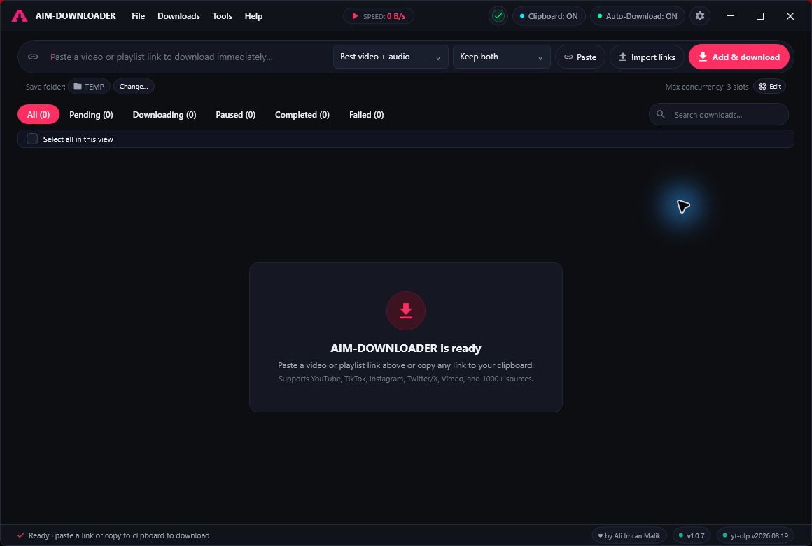

  

<h1 align="center">AIM Downloader</h1>

  <strong>Your videos. Your playlists. Ready for offline.</strong> 
  Download public videos, playlists, and audio with a Windows desktop app.

  
  
  
  

  <a href="https://github.com/malikali4129/AIM-DOWNLOADER-RELEASE/releases/latest"><strong>Download for Windows</strong></a>
  &nbsp;&middot;&nbsp;
  <a href="https://github.com/malikali4129/AIM-DOWNLOADER-RELEASE/releases">Release notes</a>
  &nbsp;&middot;&nbsp;
  <a href="https://github.com/malikali4129/AIM-DOWNLOADER-RELEASE/issues">Get support</a>

  

## Choose your download

Get both editions from the **[latest release](https://github.com/malikali4129/AIM-DOWNLOADER-RELEASE/releases/latest)**. Expand **Assets** on the release page if the files are collapsed.

| Edition | File to choose | Getting started |
| --- | --- | --- |
| **Installer** | `AIM-DOWNLOADER-<version>-win-x64-setup.exe` | Run setup for a per-user installation. |
| **Portable** | `AIM-DOWNLOADER-<version>-win-x64-portable.zip` | Extract the entire ZIP into a writable folder, then run `AIM-DOWNLOADER.exe`. |
| **Checksums** | `SHA256SUMS.txt` | Compare SHA-256 hashes to verify your downloaded files. |

**Requirements:** Windows 10 or 11, x64, a writable download folder, and an internet connection for initial tool setup. No separate .NET or Python installation is required.

> Choose the installer or portable asset. GitHub's automatic **Source code (zip)** and **Source code (tar.gz)** downloads contain this website repository, not the Windows application.

## Made for your download queue

| Feature | What you can do |
| --- | --- |
| **Videos and playlists** | Download individual videos or select the playlist entries you want. |
| **Batch input** | Paste multiple links or import a text file. |
| **Quality and audio options** | Choose video quality, extract original audio, or convert to MP3. Compatible MP4 depends on source formats. |
| **Queue controls** | Run up to three jobs at once, with pause, resume, retry, and cancel controls. |
| **Duplicate handling** | Skip known duplicates, keep both with numbered filenames, or replace completed files. |
| **Saved progress** | Keep your queue and settings between sessions; interrupted jobs recover paused. |
| **Tool management** | Set up required tools automatically, with update, repair, and rollback options. |

Pause and resume behavior depends on the source website. Pausing is unavailable during merging or conversion.

## Your first download

1. **Open AIM Downloader.** Complete the welcome steps, choose a download folder, and let tool setup finish.
2. **Paste a public link.** Review the video or playlist entries and select the items you want.
3. **Choose quality and queue it.** Pick your preferred option and add the selected items to the download queue.

Public-link support depends on the source website and upstream extractors. Private and sign-in-required content is outside the current scope. Download only media you have permission to save.

## Updates and help

Start with the [support guide](SUPPORT.md), [report a bug or request a feature](https://github.com/malikali4129/AIM-DOWNLOADER-RELEASE/issues/new/choose), or [report a security concern privately](SECURITY.md).

Find changes and previous versions in **[Releases](https://github.com/malikali4129/AIM-DOWNLOADER-RELEASE/releases)**.

For a bug report, include your AIM version, Windows version, steps to reproduce the issue, and the error message. Leave out passwords and private links.

- **Bug reports and feature requests:** [GitHub Issues](https://github.com/malikali4129/AIM-DOWNLOADER-RELEASE/issues)
- **Email:** [business.aliimranmalik@gmail.com](mailto:business.aliimranmalik@gmail.com)

## License

AIM Downloader is **proprietary freeware** by **Ali Imran Malik**. Official releases are free to download and use for personal or internal business use. Redistribution, modification, rebranding, and resale of the original application require written permission, subject to applicable law and existing rights.

Read the [application license](APP-LICENSE.txt) and the separate [website and repository terms](LICENSE.txt). Third-party components retain their own licenses and permissions. Terms supplied with a particular release govern that release; these files do not retroactively change earlier grants.

## About this repository

This is the official public home for **AIM Downloader releases, its product website, and user support**. The desktop application's source code is maintained separately in a private repository.

The website discovers downloads from this repository's public GitHub releases. Website setup and maintenance instructions are in [SETUP.md](SETUP.md).

---

Made by <strong>Ali Imran Malik</strong> &nbsp;&middot;&nbsp; AIM Downloader

## Website legal pages

The static website includes Privacy (`/privacy/`), Terms (`/terms/`), the App License (`/license/`), Cookies (`/cookies/`), and Third-party Notices (`/legal/`). They are linked in every page footer. See [Microsoft Store submission notes](MICROSOFT-STORE.md) before using the deployed URLs in Partner Center.
